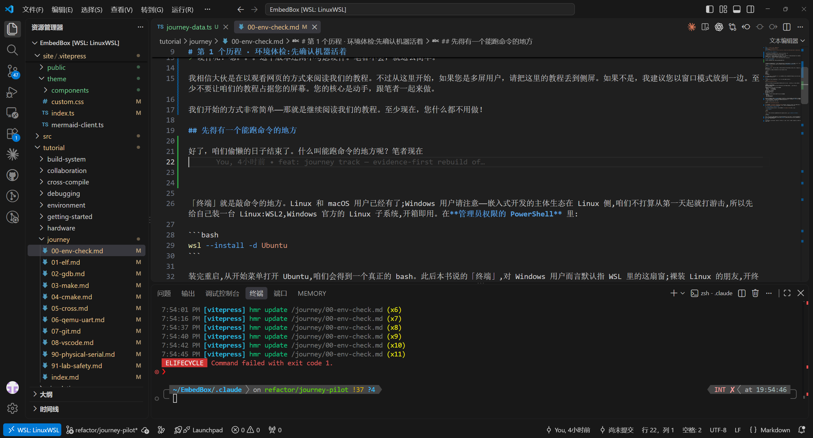
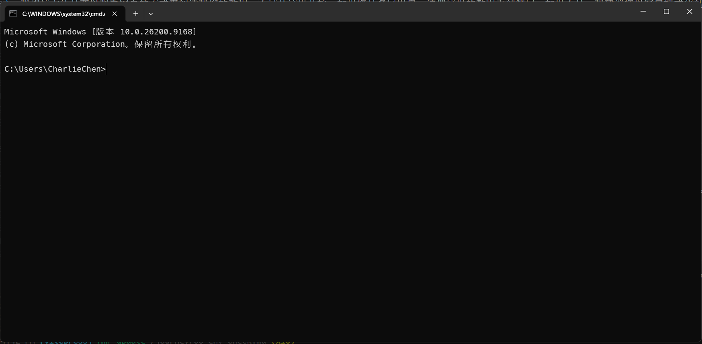
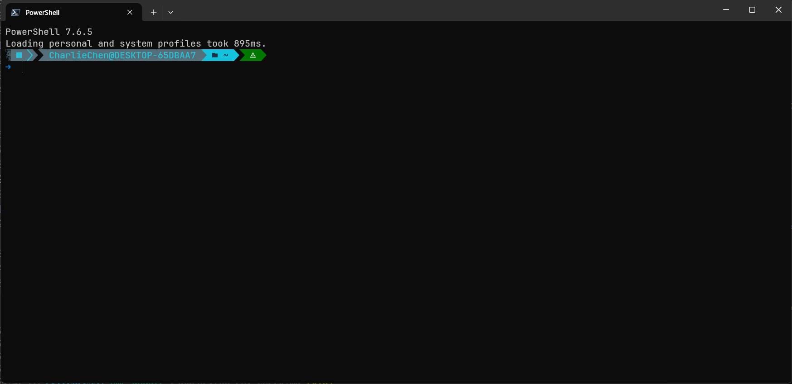

# 第 1 个历程 · 环境体检:先确认机器活着

嘿！大伙好！咱们这里是EmbededBox，也就是所有嵌入式软件开发旅途的第一站

> 硬件呢？嗯。。。这个版本还闲不考虑硬件。笔者不会，就这么简单。

我相信大伙是在以观看网页的方式来阅读我们的教程。不过从这里开始，如果您是多屏用户，请把这里的教程丢到侧屏。如果不是，我建议您以窗口模式放到一边。至少不要让咱们的教程占据您的屏幕。您的核心是动手，跟笔者一起来做。

我们开始的方式非常简单——那就是继续阅读我们的教程。至少现在，您什么都不用做！

## 先得有一个能跑命令的地方

好了，咱们偷懒的日子结束了。什么叫能跑命令的地方呢？笔者现在在的就是一个。



没看到？您可以稍微花费一些时间琢磨一下，您认为哪里是一个“能跑命令的地方”。如果您觉得这个太难了，那么这个也是，这个是大名鼎鼎的Windows cmd在Windows11的模样，如果感到陌生，您的确应该抛弃掉您的老电脑了（当然不会！）



当然如果您是一个潮流的人，您可能听说过Powershell。



这些乱七八糟的东西，就是「终端」，您看到那些电视剧中，一些自称程序员的人在一个黑乎乎的窗口里敲击键盘输入命令？恭喜，马上你也要了。

好了收回来，我们说的「终端」就是敲命令的地方。Linux 和 macOS 用户已经有了（我没有用过MacOS，这里表示歉意，上述陈述是我使用MacOS的同事说的）。我也相信当您使用这两款操作系统的时候，恐怕不至于看本教程了。如果不知道，请您发挥您的Hacker精神，去查查维基，或者是问问您喜欢的AI。

Windows用户是我们这里需要详细讲述的。一个图形的操作系统的习惯使用者可能会对终端这个概念比较陌生，这并不奇怪，但不代表这是应该的。所以，请您务必安装WSL，尽快的熟悉Linux开发环境。

WSL的安装，您可以考虑到[安装你的WSL](https://zhuanlan.zhihu.com/p/2017602632177427017)这篇文章进行阅读。或者是站内的[WSL安装教程](../environment/wsl.md)下阅读。取决于你。

笔者的终端贴过来是这样的：

```shell
[charliechen@DESKTOP-65DBAA7 EmbedBox]$ 

```

哈？看起来啥都没有在动？没关系，您在这个窗口输入一些东西，比如说我是这样做的。

```shell
[charliechen@DESKTOP-65DBAA7 EmbedBox]$ echo hello
hello
[charliechen@DESKTOP-65DBAA7 EmbedBox]$ pwd
/home/charliechen/EmbedBox
[charliechen@DESKTOP-65DBAA7 EmbedBox]$ 

```

当然，这里的话，请您提起精神，您看到了咱们输入一些东西，它能够给你一些回应，对吧。不是所有的输入都是会给你回应的

```shell
[charliechen@DESKTOP-65DBAA7 EmbedBox]$ echo hello（如果有光标，他停留在这里，因为你没有按下回车）
```

这是一种，还有一种他看起来回车了，但是我可以说，压根计算机不认识

```shell
[charliechen@DESKTOP-65DBAA7 EmbedBox]$ imcharliechen
bash: imcharliechen: command not found
```

他说 `command not found`。人话就是大哥我没找到命令。就像你跟你的朋友说去吃海底捞，他说什么是海底捞一样，回应了，但是跟没回应一样。

所以，只有终端看得懂的的东西，才能够被执行。比如说人生的一个哲学问题——我是谁？

```shell
[charliechen@DESKTOP-65DBAA7 EmbedBox]$ whoami
charliechen
```

他说我叫charliechen。

比如说我在哪？

```shell
[charliechen@DESKTOP-65DBAA7 EmbedBox]$ whoami
charliechen
[charliechen@DESKTOP-65DBAA7 EmbedBox]$ pwd
/home/charliechen/EmbedBox
```

他说我在目录 `/home/charliechen/EmbedBox`。你几乎肯定跟我这个不一样。输出一个一大堆/串起的路径，就是对的。

好了，`whoami` 打印你叫啥, `pwd` 是显示当前你在哪个路径。不错，请记住他。

下一步是使用git拉取代码。什么？不会git?或者说您甚至不知道什么是git?没关系，我们来用如下的命令来安装Git：

```shell
# 这一句话的意思是——安装git。之后咱们用
sudo apt install git
```

然后您会开始安装git，很有可能会让你确认是否下载，请您输入 'y' 后勇敢的回车。您检验git的方式非常的简单。就是像下面这样

```shell
[charliechen@DESKTOP-65DBAA7 EmbedBox]$ git --version
git version 2.55.0
```
`--verison` 是一种参数的表达形式，就像你问你的同事——嘿，你点个荤菜吧！你会说——好，点一个水煮牛肉。你完成了点的动作，同时带上了水煮牛肉这个菜品。`git --version`的含义一样，就是说明我要用git，用的方式是告诉我他的版本是多少，一个道理。

你第一次使用git的方式非常，非常的简单。麻烦您动动小手。输入一下：

```shell
[charliechen@DESKTOP-65DBAA7 tmp]$ git clone https://github.com/Awesome-Embedded-Learning-Studio/EmbedBox
Cloning into 'EmbedBox'...
remote: Enumerating objects: 193, done.
remote: Counting objects: 100% (193/193), done.
remote: Compressing objects: 100% (135/135), done.
remote: Total 193 (delta 45), reused 179 (delta 32), pack-reused 0 (from 0)
Receiving objects: 100% (193/193), 1.56 MiB | 2.27 MiB/s, done.
Resolving deltas: 100% (45/45), done.
```

当然，如果你发现git迟迟没有输出，请学会使用科学上网，这里出于法律考虑，请自行寻找教程。完成之后，请输入 `cd EmbedBox/`，这个的意思是——进入EmbedBox目录，就像您点击文件管理器的文件夹一样。

```shell
[charliechen@DESKTOP-65DBAA7 tmp]$ cd EmbedBox/
[charliechen@DESKTOP-65DBAA7 EmbedBox]$
```

好了现在在EmbedBox了，跑个脚本玩玩。

## 下面跑体检

笔者给这个历程准备的「实验」不是代码,而是一份体检脚本,它就是本章的配对验证脚本:

```bash
./scripts/journey/00-env-check.sh
```

您可能已经犯迷糊了，这是啥？嗯，就是我写的一些命令，您看不懂，没关系，我保证他不会出问题。

下面是笔者这台机器的真实输出(注意第一行——笔者自己也是在 WSL2 里干活的):

```text
──────── 机器与系统 ────────
Linux DESKTOP-65DBAA7 6.18.33.2-microsoft-standard-WSL2 #1 SMP PREEMPT_DYNAMIC ... x86_64 GNU/Linux
bash 5.3.15(1)-release

──────── 必需工具(缺任何一个,体检就是红) ────────
  [ok] git      -> /usr/sbin/git
  [ok] gcc      -> /usr/sbin/gcc
  [ok] make     -> /usr/sbin/make

──────── 工具版本 ────────
git version 2.55.0
gcc (GCC) 16.1.1 20260728
GNU Make 4.4.1

──────── 建议工具(现在缺不要紧,后面的历程会用到再装) ────────
  [ok] gdb
  [ok] cmake
  [ok] arm-none-eabi-gcc
  [ok] qemu-system-arm
```

报告分三层,值得逐层读一遍。**机器与系统**告诉你内核和架构——后面第 6 个历程交叉编译时,「x86_64」这个字眼会变成故事的另一半。**必需工具**是全书的硬门槛:git(拉代码、记录旅程)、gcc(编译)、make(构建),缺任何一个,这个历程的体检就是红的。**建议工具**是后场的队员:gdb 在第 3 个历程上场,cmake 在第 5 个,arm-none-eabi-gcc 和 qemu 要到第 6/7 个——现在缺了完全不用慌。

缺什么就补什么。Ubuntu/Debian 用户一把梭:

```bash
sudo apt install build-essential gdb cmake
```

Arch 用户对号入座 `sudo pacman -S base-devel gdb cmake`;交叉工具链和模拟器到第 6 个历程前再装也来得及(Ubuntu:`sudo apt install gcc-arm-none-eabi qemu-system-arm`)。这里先不展开每个包是什么——它们各自的章节会亲自介绍自己。

## 顺便学会一件救命的小事:command not found

总有一天(大概率是今天晚上),咱们会敲出一个命令,终端冷冷回一句 `command not found`。别慌,三板斧:

第一斧,**它装了吗**:

```bash
which gcc
```

`which` 在 PATH 里找这个命令,找到了就打印它的位置,找不到就一声不吭。第二斧,**它在的地方 shell 知道吗**:

```bash
echo "$PATH"
```

PATH 是 shell 的寻人启事列表,冒号分隔的一串目录。命令明明装了却报 not found,九成是它所在的目录不在这串列表里——第 6 个历程 装完交叉工具链、第 9 个历程 配编辑器时,你还会再遇到这个局面。第三斧,**名字对吗**:拼写、大小写、连字符,以及「我以为我装了」的自我怀疑。这三斧会陪咱们穿过全书,也会陪咱们穿过之后所有的嵌入式，甚至可以说是自己计算机程序员的生涯！
