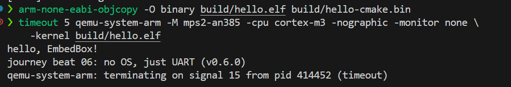

# 第 7 个历程 · 没有屏幕的机器:它亲口向咱们问好

这是全书的高潮。上一个历程结束时,咱们手里是一颗造好却无处安放的 ARM 心脏;这个历程,QEMU 给它一副身体——一块虚拟的、没有操作系统的、**没有屏幕的**板子。程序将在上面自己开机、自己初始化,然后通过一根串口线,亲口向世界问好。咱们将拿到这本书的签名产物:一份 CI 背书的串口运行证据。

咱们的虚拟板叫 `mps2-an385`,CPU 是 Cortex-M3——**和 STM32 主流型号同一个家族**。这不是随手挑的:咱们在这个历程写的每一行启动代码,将来搬到真 STM32 上,骨架几乎不变。

动手地点是 src/journey/06-qemu-uart/。需要的工具这回齐了:`arm-none-eabi-gcc`、`qemu-system-arm`(第 1 个历程 的建议工具全部到岗)。您 cd 过去,咱们上电。

## 先解决一个哲学问题:谁叫醒 main?

在宿主机上,`./hello` 之前有一整个操作系统在铺床:加载 ELF、设好栈、把环境变量摆好,然后才跳到 main。裸机上**没有这位管家**——CPU 上电后只做一件事:从地址 0 读两个数,第一个当栈顶,第二个当入口。所以裸机程序的第一份文件不是 main,是**出生证明**:

```c
/* 主线第 7 个历程 · 出生证明:向量表 + 复位流程
 * 对应教程:tutorial/journey/06-qemu-uart.md
 * 目标板:QEMU mps2-an385(Cortex-M3)
 */
#include <stdint.h>
#include <stddef.h>

/* gcc 会把「抄写循环」识别成 memcpy 调用、把「清零循环」识别成 memset 调用;
 * -nostdlib 的世界里没有 libc,所以裸机工程自带这两个最小实现。 */
void *memcpy(void *dst, const void *src, size_t n)
{
    unsigned char *d = dst;
    const unsigned char *s = src;
    while (n--) *d++ = *s++;
    return dst;
}

void *memset(void *dst, int c, size_t n)
{
    unsigned char *d = dst;
    while (n--) *d++ = (unsigned char)c;
    return dst;
}

/* 这些地址全部由链接脚本(linker.ld)定义 */
extern uint32_t _estack;   /* 初始栈顶 */
extern uint32_t _sidata;   /* .data 的行李在 flash 里的位置 */
extern uint32_t _sdata;    /* .data 在 RAM 里的家 */
extern uint32_t _edata;
extern uint32_t _sbss;     /* .bss 在 RAM 里的家 */
extern uint32_t _ebss;

int main(void);

void Reset_Handler(void)
{
    uint32_t *src = &_sidata;
    uint32_t *dst = &_sdata;
    while (dst < &_edata)              /* .data:把行李从 flash 搬进 RAM */
        *dst++ = *src++;

    for (dst = &_sbss; dst < &_ebss; dst++)   /* .bss:按合同清零 */
        *dst = 0;

    (void)main();
    for (;;) { }                       /* main 不该回来;回来了就原地罚站 */
}

/* Cortex-M 的向量表:第 0 项是初始栈顶,第 1 项是复位入口。
 * 硬件复位时自己读这张表,不需要咱们写一行汇编。 */
__attribute__((section(".isr_vector"), used))
const uintptr_t vector_table[] = {
    (uintptr_t)&_estack,
    (uintptr_t)Reset_Handler,
};
```

开头那对 `memcpy`/`memset` 不是炫技,是**笔者真实的踩坑**:第一版笔者只写了两个裸的 while 循环,链接器当场罢工——`undefined reference to memcpy`。原因是 gcc 的「循环模式识别」会把抄写循环悄悄换成 `memcpy` 调用,而 `-nostdlib` 的世界里没有 libc。咱们以为在写循环,编译器译成了函数调用——汇编层看到的才是真相,这句话在第 2 个历程 就说过了。

两样随身小物先认一下:`stdint.h` 里的 `uint32_t` 是「正好 32 位的无符号整数」——把宽度说死,不看 `int` 在不同机器上的脸色,在两套架构之间搬家的路上,这是保命的习惯;`size_t` 则是「能装下任何对象大小」的无符号类型,标准数数用的就是它。然后是这张表的读法。`vector_table` 用 `__attribute__((section(".isr_vector")))` 放进一个专门的段,链接脚本保证它是 flash 的**第一块**——因为硬件复位时无条件从地址 0 读它:第 0 项 `_estack` 是初始栈顶(栈从 RAM 顶端向下长),第 1 项 `Reset_Handler` 是入口。这就是「谁叫醒 main」的完整答案:**硬件读表,跳进 Reset_Handler,它搬完家,再叫 main。**

而 `Reset_Handler` 干的两件事,正是第 2 个历程 埋的伏笔全部兑现。

`.data` 段的变量「初值在 flash、生活在 RAM」,所以要把行李从 flash 抄进 RAM`.bss` 段按合同是全零(NOBITS,不占文件一字节),所以上电第一件事是把那块 RAM 刷干净。当时说「程序启动时内存里划一块零就行」——划零的人,就是这里。

对了,`(void)main()` 那个 `(void)` 不是装饰:main 返回 int,咱们把返回值故意扔掉,写明是告诉 `-Wall`「故意的,别念叨」。

## 住址由这张纸决定

出生证明里那些 `_estack`、`_sdata`,不是变量,是链接脚本签发的地址——`extern` 在这里只是「先报个户口,本体在别处」的声明(第 4 个历程 菜单与厨房的分工),妙就妙在「别处」居然是一份链接脚本。裸机世界里没有操作系统替咱们选加载地址,**每个段住在哪,咱们自己说了算**:

还是看不懂？没关系，我们之后会有专门的仓库仔细的盘算“链接脚本”这个课程。

```ld
/* 主线第 7 个历程 · 没有屏幕的机器 —— 程序的住址由这张纸决定
 * 对应教程:tutorial/journey/06-qemu-uart.md
 * 目标:QEMU mps2-an385 —— 代码区在 0x00000000,RAM 在 0x20000000
 */
ENTRY(Reset_Handler)

MEMORY
{
    FLASH (rx)  : ORIGIN = 0x00000000, LENGTH = 512K
    RAM   (rwx) : ORIGIN = 0x20000000, LENGTH = 512K
}

_estack = ORIGIN(RAM) + LENGTH(RAM);   /* 栈从 RAM 顶端向下长 */

SECTIONS
{
    .isr_vector : {
        KEEP(*(.isr_vector))           /* 向量表必须是第一块 */
    } > FLASH

    .text : {
        *(.text*)
        *(.rodata*)
    } > FLASH

    _sidata = LOADADDR(.data);         /* .data:行李在 flash,人在 RAM */

    .data : {
        _sdata = .;
        *(.data*)
        _edata = .;
    } > RAM AT > FLASH

    .bss : {
        _sbss = .;
        *(.bss*)
        *(COMMON)
        _ebss = .;
    } > RAM
}
```

`MEMORY` 块声明这块板的两片地:flash 从 0 开始(向量表必须住在 0),RAM 从 0x20000000 开始——这两个地址来自板子的手册,QEMU 照着真实硬件建模。

`SECTIONS` 里每一行都是第 2 个历程 `readelf -S` 看过的老朋友,只是这次它们的位置**由咱们分配**。分配时手里捏着一支游标:脚本里那个孤零零的点 `.` 表示「当前位置」,`_sdata = .` 就是把游标此刻的读数记下来当书签。`KEEP(*(.isr_vector))` 里的 KEEP 是保险——向量表没有任何代码显式引用它(来读它的是硬件,链接器不知道这层关系),开裁剪时可能被当垃圾扔掉,KEEP 明确说不许。

`*(COMMON)` 收的是「无初值全局变量」的老式合并区,跟 `.bss` 一个待遇,顺手一起清零。最有意思的是 `.data : > RAM AT > FLASH`:两个地址——运行地址在 RAM(`> RAM`),存储地址在 flash(`AT > FLASH`),`LOADADDR` 取的正是行李的存身处。Startup 里那趟搬家,搬的就是这两地址之间的差。

## 串口:这台机器唯一的嘴

没有屏幕、没有 printf、没有操作系统——输出靠什么?靠 **UART**(通用异步收发器,串口这门手艺的主力)。它是一块**外设**:所谓外设,就是 CPU 之外、挂在总线上替 CPU 干活的功能块——串口、定时器、GPIO 都是。咱们往特定地址写一个字节,它就把这个字节变成电平波形发出去。这就是嵌入式世界的老话:**串口就是板子的 stdout**。

```c
/* 主线第 7 个历程 · 没有屏幕的机器:串口是我们唯一的嘴
 * 对应教程:tutorial/journey/06-qemu-uart.md
 * 目标板:QEMU mps2-an385(Cortex-M3),UART0 = CMSDK APB UART
 */
#include <stdint.h>

#define UART0_BASE   0x40004000UL
#define UART_DATA    (*(volatile uint32_t *)(UART0_BASE + 0x00))
#define UART_STATE   (*(volatile uint32_t *)(UART0_BASE + 0x04))
#define UART_CTRL    (*(volatile uint32_t *)(UART0_BASE + 0x08))
#define UART_BAUDDIV (*(volatile uint32_t *)(UART0_BASE + 0x0C))

#define UART_STATE_TXBF (1u << 0)      /* 发送缓冲满:满了就等 */
#define UART_CTRL_TXEN  (1u << 0)      /* 打开发送 */

static void uart_init(void)
{
    UART_BAUDDIV = 16;                 /* QEMU 不仿真波特率时序;真板按 PCLK/baud 算 */
    UART_CTRL = UART_CTRL_TXEN;        /* 我们只需要说话,不需要听 */
}

static void uart_putc(char c)
{
    while (UART_STATE & UART_STATE_TXBF) { }
    UART_DATA = (uint32_t)c;
}

static void uart_puts(const char *s)
{
    while (*s) {
        if (*s == '\n')
        {
            /* 串口世界的礼貌:\n 前面补一个 \r */
            uart_putc('\r');
        }           
        uart_putc(*s++);
    }
}

int main(void)
{
    uart_init();
    uart_puts("hello, EmbedBox!\n");
    uart_puts("journey beat 06: no OS, just UART (v0.6.0)\n");
    for (;;) { }                       /* 裸机主循环:永远不许返回 */
}
```

这段代码每个字都值得初学者看三遍。`0x40004000` 是这块板 UART0 的基地址(来自板子手册),`+0x00/0x04/0x08` 的偏移是 CMSDK UART 的寄存器排布:DATA 是数据口,STATE 是状态,CTRL 是开关,BAUDDIV 是波特率分频——波特率就是双方约好的「每秒发多少位」的语速,分频值决定它。寄存器里的开关按「位」居住:`1u << 0` 造出一个只有第 0 位是 1 的数,而 `UART_STATE & UART_STATE_TXBF` 只看第 0 位、其余一概不理——位的移与与,是嵌入式每天的算术。最外层那圈 `(*(volatile uint32_t *)...)` 是嵌入式的心跳:不加 `volatile`,编译器看程序循环读一个「没改过的地址」,会好心地把读操作优化掉——于是 CPU 永远等不到缓冲区变空,程序死在等待里。真板和 QEMU 都会如实扮演这个坑。这套「寄存器就是内存里的地址,读写地址就是操作硬件」的打法,行话叫内存映射 IO(MMIO)——CPU 眼里没有什么「外设」分类,只有一批带副作用的地址。

`uart_putc` 的逻辑是所有外设驱动的母版:**等硬件准备好,再动手**。TXBF(发送缓冲满)是 UART 在说「上一个字节我还没发完」,咱们就等。`uart_puts` 里补 `\r` 是串口世界的礼貌:很多终端把 `\n` 只当「下移一行」不当「回到行首」,`hello` 会变成阶梯——补一个 `\r` 才是干净的换行。

## 上电

构建流程和第 6 个历程 同构,几个新面孔:`-mcpu=cortex-m3` 精确点名 CPU,`-mthumb` 选 Thumb 指令集(它的现代形态 Thumb-2,第 6 个历程 提过一嘴),`-nostdlib` 宣布谁都不借,`-T linker.ld` 递上咱们自己签发的住址纸:

```bash
arm-none-eabi-gcc -c -mcpu=cortex-m3 -mthumb -Wall -Wextra -g -O2 startup.c -o startup.o
arm-none-eabi-gcc -c -mcpu=cortex-m3 -mthumb -Wall -Wextra -g -O2 main.c -o main.o
```

```bash
arm-none-eabi-gcc -nostdlib -T linker.ld startup.o main.o -o hello.elf
```

先验货。`objdump -f` 这次有三处新看点:

```bash
arm-none-eabi-objdump -f hello.elf
```

```text

hello.elf:     file format elf32-littlearm
architecture: armv7, flags 0x00000112:
EXEC_P, HAS_SYMS, D_PAGED
start address 0x00000009
```

flags 里 `HAS_RELOC` 没了,换来 **`EXEC_P`**——第 2 个历程 讲过,目标文件「有待重定位项」,链接完成后地址全部落定,这回是在咱们自己的链接脚本上落定的。架构栏的 `armv7` 替代了第 6 个历程 的默认档 `armv4t`,这是点名 CPU 的效果。还有一个悬案:start address 是 `0x9`,可 Reset_Handler 明明在地址 0x8?这是 Cortex-M 的 Thumb bit:入口地址的 bit0 置 1 表示「这是 Thumb 指令」,CPU 取指前自动把它抹掉——这个 bit0,在后面的反汇编和链接脚本里还会反复露面。

再出裸二进制,看体重:

```bash
arm-none-eabi-objcopy -O binary hello.elf hello.bin
ls -l hello.elf hello.bin
```

```text
-rwxr-xr-x 1 charliechen charliechen   268 Aug 23 14:49 hello.bin
-rwxr-xr-x 1 charliechen charliechen  9388 Aug 23 14:49 hello.elf
```

**268 字节。** 上一个历程拖着半主机后端的 `.bin` 是 62KB——这回没有 newlib、没有 rdimon、没有别人的家具,向量表、启动代码、两个驱动函数、两句话,全部家当 268 字节。这就是裸机的体重。

然后,上电:

```bash
timeout 5 qemu-system-arm -M mps2-an385 -cpu cortex-m3 -nographic -monitor none \
    -kernel hello.elf
```

五个参数逐个读:`-M mps2-an385` 指定机器型号(板子);`-cpu cortex-m3` 指定 CPU;`-nographic` 关掉图形界面,**把串口直接接到咱们的终端**;`-monitor none` 关掉 QEMU 自带的控制台,免得它和串口抢 stdin(程序的标准输入,就是咱们在终端敲的字);`-kernel hello.elf` 把镜像塞进板子并按下复位键。`timeout 5` 是因为咱们这位主角说完话就进死循环,不打算退休,5 秒后替它关机。终端上出现的是:

```text
hello, EmbedBox!
journey beat 06: no OS, just UART (v0.6.0)
```

不够带劲，我们来看看实际的样子！



**它开口了。** 从一行 `hello.c` 走到这里:被解剖、生过病、长成三个文件、住进 CMake 工程、搬过家——现在它住在一块没有操作系统的板子上,用一根(虚拟)串口线向咱们问好。这就是 community 计划书里那句「在 QEMU 中运行,并保存一次可追溯的串口或运行结果」的前半句。

## 证据落袋

后半句「可追溯」现在完成。先把串口输出捕获成文件——在运行命令后面接 `> serial.txt`,这叫重定向:把本该打到屏幕上的字,引进文件里存着。然后和仓库里预存的期望值用 `diff` 比对(`-u` 是把差异连同上下文一起摊开的显示格式)。diff 的规矩很有性格:**一致时它一个字都不说**——沉默即通过。您可以试试看用一下。

## 把搬家也交给管家:工具链文件

手敲上面那三条命令,为的是把每一棒的新面孔看真切。但第 5 个历程 吹过的牛不能烂账——「换一个工具链文件,重新配置」,CMake 在两套工具链之间切换的底气,现在当场兑现。两个新文件,先看小的:

```cmake
# 主线第 7 个历程 · 没有屏幕的机器 —— 工具链文件:CMake 的「这单活用哪套工具」
# 对应教程:tutorial/journey/06-qemu-uart.md
# 用法:cmake -S . -B build -DCMAKE_TOOLCHAIN_FILE=arm-none-eabi.cmake
set(CMAKE_SYSTEM_NAME Generic)      # 裸机:没有操作系统
set(CMAKE_SYSTEM_PROCESSOR arm)     # 目标机是 ARM
set(CMAKE_C_COMPILER arm-none-eabi-gcc)
# 裸机上链不出可执行文件,探测编译器时只编译、不链接
set(CMAKE_TRY_COMPILE_TARGET_TYPE STATIC_LIBRARY)
```

工具链文件(toolchain file)就是一张委派书:配置期递给 CMake,告诉它这单活请哪套工具、干给哪种机器。`Generic` 是 CMake 的行话,「没有操作系统」的意思;最后那行是裸机的暗门——CMake 探测编译器时默认要试着链一个可执行文件,而裸机链不出,得让它只编译、不链接。再看工程本体:

```cmake
# 主线第 7 个历程 · 没有屏幕的机器 —— 裸机构建交给 CMake 收编
# 对应教程:tutorial/journey/06-qemu-uart.md
# 配合 arm-none-eabi.cmake(工具链文件)使用,见上文件头的用法
cmake_minimum_required(VERSION 3.16)

project(journey_baremetal C)

add_executable(hello.elf startup.c main.c)
target_compile_options(hello.elf PRIVATE
    -mcpu=cortex-m3 -mthumb -Wall -Wextra -g -O2)
target_link_options(hello.elf PRIVATE
    -mcpu=cortex-m3 -mthumb -nostdlib -T ${CMAKE_CURRENT_SOURCE_DIR}/linker.ld)
```

认一认熟人:三条手敲命令一个字没丢,只是换了住处——`-mcpu`/`-mthumb`/警告/`-g`/`-O2` 住进 `target_compile_options`,`-nostdlib` 和 `-T linker.ld` 住进 `target_link_options`(`${CMAKE_CURRENT_SOURCE_DIR}` 是「CMakeLists 所在目录」,防止从别处配置时找不到链接脚本)。还是第 5 个历程 那句话:命令照跑,但咱们维护的是**声明**,不是过程。然后,老两步——注意委派书是配置期递的:

```bash
cmake -S . -B build -DCMAKE_TOOLCHAIN_FILE=arm-none-eabi.cmake
cmake --build build
```

```text
-- The C compiler identification is GNU 16.1.0
-- Check for working C compiler: /usr/sbin/arm-none-eabi-gcc - skipped
-- Configuring done (0.1s)
-- Generating done (0.0s)
-- Build files have been written to: /tmp/.../build
[ 33%] Building C object CMakeFiles/hello.elf.dir/startup.c.obj
[ 66%] Building C object CMakeFiles/hello.elf.dir/main.c.obj
[100%] Linking C executable hello.elf
[100%] Built target hello.elf
```

配置日志里那行 `Check for working C compiler ... - skipped`,就是暗门生效的样子。最后验货,两条生产线对撞——`cmp` 比对二进制文件,diff 的表亲,一致时同样一言不发:

```bash
arm-none-eabi-objcopy -O binary build/hello.elf hello-cmake.bin
cmp hello.bin hello-cmake.bin
```

沉默,即逐字节一致。`build/hello.elf` 再进一次 QEMU,串口输出与 expected-serial.txt 依然分毫不差(配对脚本把这整套也纳入了断言)。管家上岗,誓言兑现——往后工程要在宿主机和目标机两边同时构建,就是多一份委派书的事。

## 兑现一个伏笔:target remote

第 3 个历程 结尾说过:这一切终将隔着一条线搬过去。现在程序在另一台机器里,咱们隔着 TCP 隔空调试。动手前交代一处看起来像「自相矛盾」的地方:第 3 个历程 立过「调试用 `-O0`」的规矩,这次却编了 `-O2`——裸机寸土寸金是一层理由,更实在的是今天的断点都落在函数入口,`-O2` 不碍事;真要逐行追变量,把构建里的 `-O2` 换回 `-O0` 重来即可。规矩是活的,取舍要明说:

```bash
gdb -q -batch -iex 'set debuginfod enabled off' \
    -ex 'target remote localhost:12345' \
    -ex 'break main' \
    -ex 'continue' \
    -ex 'bt' \
    hello.elf
```

(先把 QEMU 用 `-S -gdb tcp::12345` 起在后台——`-S` 让它开机即停,`-gdb` 打开一个 gdbstub 服务口。)

这里有个发行版分岔,先打预防针:Ubuntu 的原生 `gdb` 是单架构构建,连上 ARM 目标会警告 `unknown architecture "arm"`,然后当场失联——Ubuntu 用户要请的是 `gdb-multiarch`(`sudo apt install gdb-multiarch`),之后把命令里的 `gdb` 换成 `gdb-multiarch`,其余一字不动;Arch 这类发行版的 gdb 生来全架构,没有这道坎。配对脚本会自己挑人。

```text
Reset_Handler () at startup.c:39
39	    while (dst < &_edata)              /* .data:把行李从 flash 搬进 RAM */
Breakpoint 1 at 0xa8: file main.c, line 18.

Breakpoint 1, main () at main.c:18
18	    UART_BAUDDIV = 16;                 /* QEMU 不仿真波特率时序;真板按 PCLK/baud 算 */
#0  main () at main.c:18
[Inferior 1 (process 1) detached]
```

读这份成绩单:一接上,程序正停在 `Reset_Handler` 搬 `.data` 的行——开机即停的效果;`break main` 之后 `continue`,断点隔着一条 TCP 线**精准命中另一台机器里的 main**,`bt` 递上调用栈(末尾那行 `[Inferior 1 ... detached]` 是 `-batch` 收工时自动松手告辞——inferior 是 gdb 给「被调试者」起的学名)。命令还是第 3 个历程 那五件套,一个字没变,变的只是被调试者住在本机进程还是板子里。将来咱们调试真 STM32,用的 OpenOCD 干的就是 QEMU 这个 `-gdb` 的活:把芯片的调试口翻译成同一套 gdb 协议。今天这堂课,直接复用。

## 这个历程咱们带走了什么

一份出生证明(向量表 + 复位流程,`.data`/`.bss` 的搬家与清零)、一张住址纸(链接脚本,MEMORY 与 SECTIONS)、一个驱动母版(volatile MMIO + 等硬件准备好)、一枚指纹(expected-serial.txt)、一张委派书(工具链文件,CMake 收编裸机构建——第 5 个历程 的承诺兑现)——还有 `target remote`,和一根永远通向真板的线。268 字节,无借贷,全部家当由咱们自己签名。

到这里,**「从 clean clone 到可追溯的串口证据」的完整链条咱们已经亲手走通了一次**。这也是本书主线的技术终点——剩下的几个历程,讲的是怎么和这位新朋友共同生活:怎么记录它、怎么让编辑器认识它、以及怎么把它送上真正的硬件。

## 下一站

机器开口说话了。但如果这段旅程丢了——代码没处放、改动没法回溯、成果没法交给人——一切等于没发生。下一个历程,把旅程记下来:Git 的深度,和一份像样的 README。
